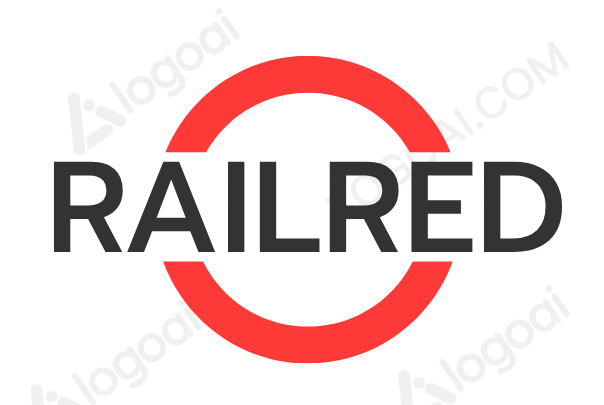

# RailRed



RailRed simulates a TCMS system over Node-Red. This is the official implementation of the conference paper 

**Title of the paper**

by Jesús F. Cevallos M.$^\star$, Domenico Cotroneo $^\dagger$, Simona De Vivo $^\dagger$, Raffaele Della Corte $^\dagger$, Vittorio Orbinato $^\dagger$, Alessandra Rizzardi $^\star$, Sabrina Sicari $^\star$, and Alberto Coen Porisini $^\star$

$\star$ Dipartimento di Scienze Teoriche e Applicate - Università degli Studi dell'Insubria, via O. Rossi 9, Varese (VA), 21100, Italy  
$\dagger$ Dipartimento di Ingegneria Elettrica e delle Tecnologie dell'Informazione - Università degli Studi di Napoli Federico II, via Claudio 21, Naples (NA), 80125, Italy

**Emails:**  
{jf.cevallosmoreno, alessandra.rizzardi, sabrina.sicari, alberto.coenporisini}@uninsubria.it  
{cotroneo, simona.devivo, raffaele.dellacorte2, vittorio.orbinato}@unina.it

## Prerequisites

Before you can run RailRed, ensure you have the following installed on your system:

- **Docker**: For containerizing the application and its services.
- **Python 3.x**: The latest version of Python 3.x is recommended.
- **(Optional) OpenSSL**: For generating keys and certificates, (you can do it from our docker container if you prefer...)

### Installing Docker

To install Docker on your system, follow the [official Docker installation guide](https://docs.docker.com/get-docker/).

For example, on Ubuntu:
```bash
# Update the package list
sudo apt-get update

# Install Docker
sudo apt-get install docker-ce docker-ce-cli containerd.io
```

### Installing Python

To install Python on your system, follow the [official Python installation guide](https://www.python.org/downloads/).

For example, on Ubuntu:
```bash
# Update the package list
sudo apt-get update

# Install Python
sudo apt-get install python3 python3-pip
```

## Setting Up the Project

### Step 1: Clone the Repository

Clone the RailRed repository from GitHub:
```bash
git clone https://github.com/iot_on_ai_rails/railred.git
cd railred
```

### Step 2: Create a Virtual Environment

Create a virtual environment to isolate project dependencies:
```bash
# Create a virtual environment named 'venv'
python3 -m venv venv

# Activate the virtual environment
source venv/bin/activate
```

### Step 3: Install Python Dependencies

Install the required Python packages from the `requirements.txt` file:
```bash
# Ensure the virtual environment is activated
pip install -r requirements.txt
```

## Step 4: Place your csv data in the nodered_server/data directory 
You should place a dataset.csv and a clusters.csv file in this directory containing the anomalies you want to reproduce. 


## Step 5: Generating and Placing Keys

**Important**: Before launching the application, you need to generate a pair of private and public keys. These keys are crucial for the secure operation of RailRed.

1. **Generate the Keys**:
   You can use OpenSSL or any other preferred method to generate the keys. Here is a basic command to generate RSA keys using OpenSSL:
   ```bash
   openssl genpkey -algorithm RSA -out private_key.pem
   openssl rsa -pubout -in private_key.pem -out public_key.pem
   ```

2. **Place the Keys**:
   Place the generated `private_key.pem` and `public_key.pem` in the following directory:
   ```
   nodered_server/data
   ```

   Ensure these keys are secure and not exposed to unauthorized access.

## Step 6: Build the docker images

Use the makefile to build our images. (It may take some time, depending on you internet connection)
```bash
make all
```

## Final Step: Launching the Application!

To start RailRed, run the `startnstream.py` script:
```bash
python startnstream.py
```

This script will initialize all necessary services and configurations required for RailRed to operate.

## Contributing

We welcome contributions to RailRed. To contribute, follow these steps:

1. Fork the repository.
2. Create a new branch with a descriptive name (`feature/your-feature-name`).
3. Make your changes and commit them.
4. Push your branch to your forked repository.
5. Create a pull request to the main repository.

## License

RailRed is licensed under the MIT License. See the [LICENSE](LICENSE) file for more information.

## Contact

For any inquiries or issues, please contact the project maintainers at [railred@example.com].

---

Thank you for using RailRed! We hope this project meets your needs and expectations.
```

### Notes:
- Replace `https://github.com/yourusername/railred.git` with your actual GitHub repository URL.
- Update the contact email address and any other placeholders to reflect your project's specific details.
- This README provides a comprehensive guide from installation to running the application, ensuring users can set up and start using RailRed with ease.